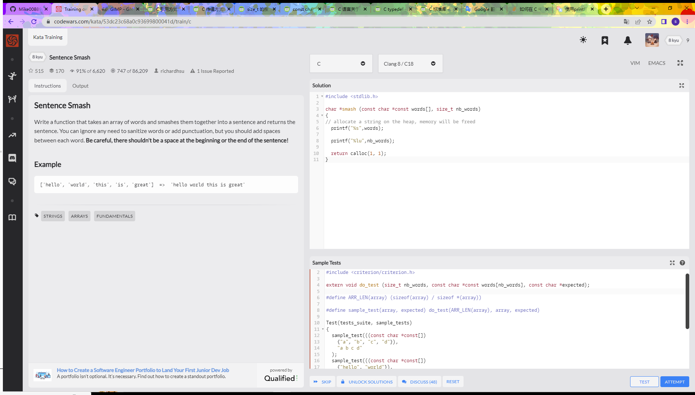
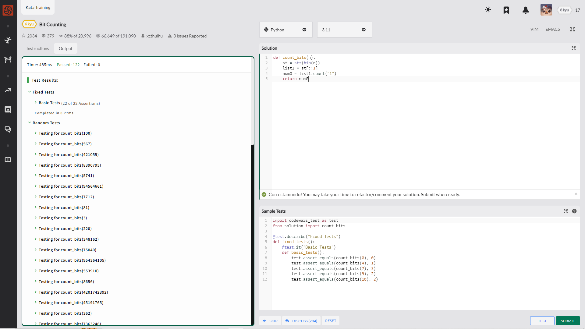
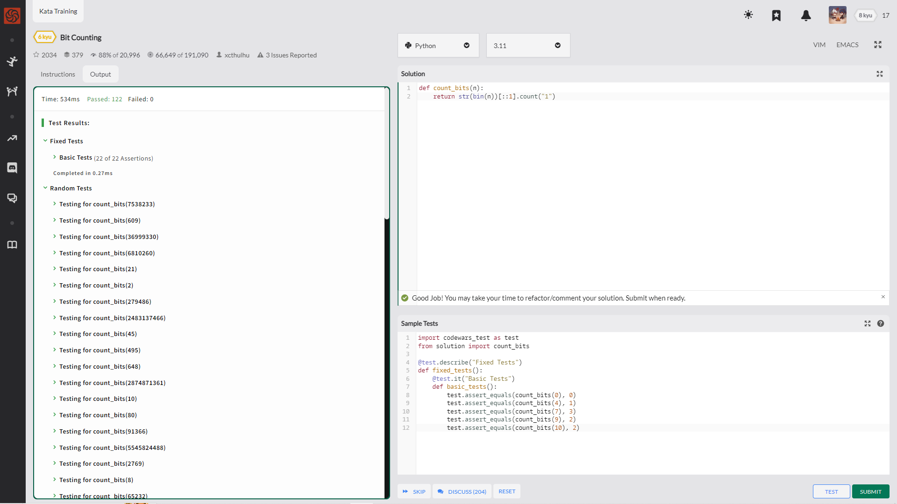
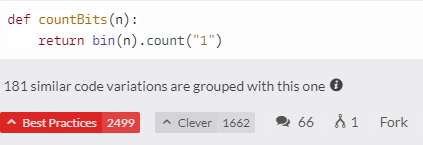

呼~ 冷静 冷静 冷静

重学吧

数组 可以储存一个固定大小的相同类型元素顺序集合

size_t

const char*, char const*, char*const 的区别

在函数声明中，参数的名称并不重要，只有参数的类型是必需的

不行了 坚持不下去了 不浪费时间了 

---

    #include <stdio.h>
    #include <string.h>

    char *smash(const char **words, size_t count)
    {
    int total_len = count - 1;
    for (int x = 0; x < count; ++x)
        total_len += strlen(words[x]);
        
    char *r = malloc(total_len + 1);
    if (!r) return 0;
    
    for (int x = 0, fwd = 0; x < count; ++x)
        fwd += sprintf(r + fwd, "%s ", words[x]);
        
    r[total_len] = 0;
    return r;
    }

---

    #include <string.h>

    char *smash(const char **words, size_t count) {
        size_t len = 0;
        for (size_t i=0; i<count; i++) len += strlen(words[i]);
        
        char *res = calloc(len+1, sizeof(char));
        for (size_t i=0; i<count; ) {
            strcat(res, words[i]);
            if (++i < count) strcat(res, " ");
        }
        
        return res;
    }

---
---
---
---

*sigh*

终究还是活成了别人的样子(DOGE)

哦呦 惜字如金的社区大佬啊

    说实话 这一天确实该冷静下来考虑一下今后的方向问题 按理来说 都是C入门后 开始其他语言的学习 可我现在想回去学C了 或许应该冷静下来 看看今后会用到的究竟是什么 目前来说 应该是啥都会一点 然后精一门 
    冷静下来考虑一下目前的方向 题目先以Python的为主 然后C的基础从头慢慢开始 C的那道题折腾搜索了一上午 最终还是放弃了 底层的东西学学没错 但是 别指望硬塞 192的身高也不是一天长起来的