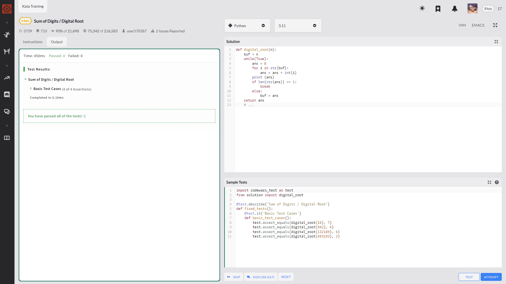
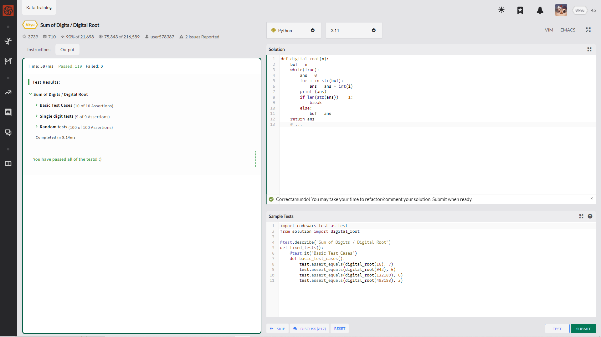

Digital root is the recursive sum of all the digits in a number.

Given n, take the sum of the digits of n. If that value has more than one digit, continue reducing in this way until a single-digit number is produced. The input will be a non-negative integer.

描述简单 就是 给个数 然后返回其数字根(不过数字根有啥实际用途吗？或许可以用于校验？)

Examples

    16  -->  1 + 6 = 7
    942  -->  9 + 4 + 2 = 15  -->  1 + 5 = 6
    132189  -->  1 + 3 + 2 + 1 + 8 + 9 = 24  -->  2 + 4 = 6
    493193  -->  4 + 9 + 3 + 1 + 9 + 3 = 29  -->  2 + 9 = 11  -->  1 + 1 = 2

    def digital_root(n):
        buf = n                     # 准备一个容器放数字
        while(True):                # 创建一个循环
            ans = 0                 # 创建or清空一个结果容器
            for i in str(buf):      # 将int转换为str并依次遍历
                ans = ans + int(i)  # 然后用再转换回int 依次加到ans里边
            if len(str(ans)) == 1:  # 如果结果为个位数(其实这不用转换写ans>9也行)
                break               # 终止循环
            else:                   # 如果结果不为个位数
                buf = ans           # 将目前结果作为新的数字赋值给buf
        return ans

---

社区时间！

---

    def digital_root(n):
        j = 0
        while n > 9:
            for i in str(n):
                j += int(i)
            n = j
            j = 0
        return n

---

    def digital_root(n):
        return 1 + ((int(n) - 1) % 9) if n>0 else 0

---

    def digital_root(n):
        return n if n < 10 else digital_root(sum(map(int,str(n))))

用到了map与sum? 转换格式后映射然后求和？

---

    def digital_root(n):
        return n%9 or n and 9 

这里用到了一个数学知识 说实话 有点别扭

https://math.stackexchange.com/questions/1221486/a-pedagogical-proof-that-9s-can-be-ignored-when-calculating-digital-roots

---

