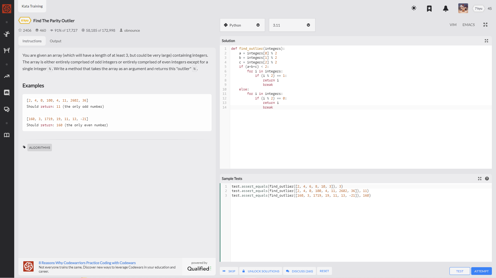
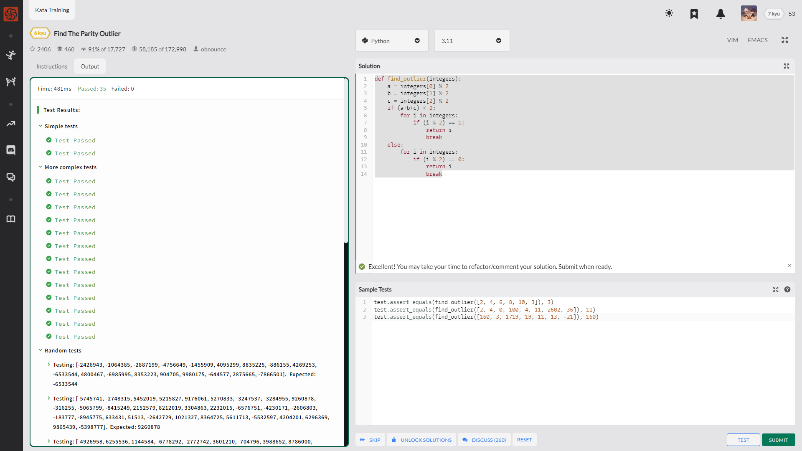
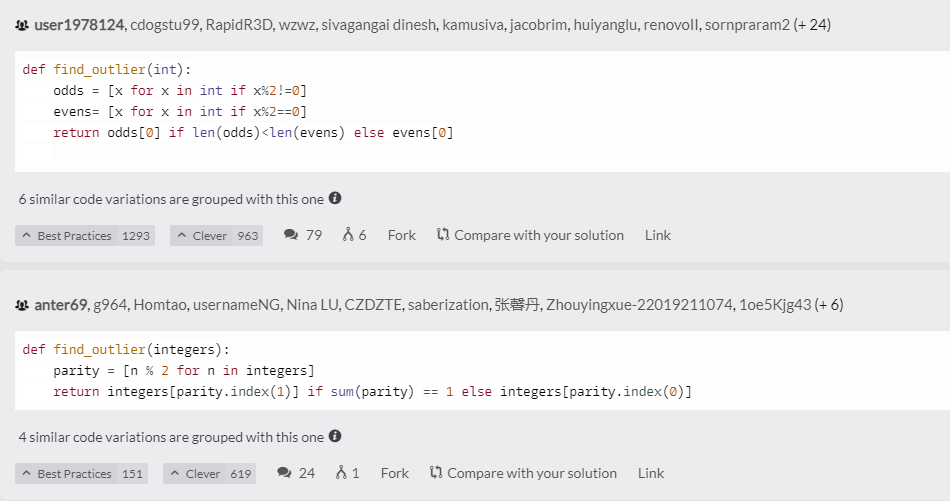
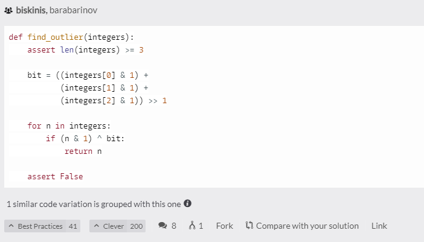

You are given an array (which will have a length of at least 3, but could be very large) containing integers. The array is either entirely comprised of odd integers or entirely comprised of even integers except for a single integer N. Write a method that takes the array as an argument and returns this "outlier" N.

简单解释一下就是 给你一个列表至少大于3的列表

只有两种情况 一个奇数跟一堆偶数 或 一个偶数跟一堆奇数

找出那"一个"数

Examples

    [2, 4, 0, 100, 4, 11, 2602, 36]
    Should return: 11 (the only odd number)

    [160, 3, 1719, 19, 11, 13, -21]
    Should return: 160 (the only even number)

---

测试数据还是比较全面的 有零有负数

    test.assert_equals(find_outlier([2, 4, 6, 8, 10, 3]), 3)
    test.assert_equals(find_outlier([2, 4, 0, 100, 4, 11, 2602, 36]), 11)
    test.assert_equals(find_outlier([160, 3, 1719, 19, 11, 13, -21]), 160)

    def find_outlier(integers):
        a = integers[0] % 2 # 挑选前三个
        b = integers[1] % 2 # 采用取余运算
        c = integers[2] % 2 # 因为只有一个数与众不同 
        if (a+b+c) < 2: # 所以三个数相加 结果为1 0 为存在两个以上的偶数 即要找的为奇数
            for i in integers:
                if (i % 2) == 1: # 循环遍历判定是否为奇数
                    return i
                    break
        else:           # 结果为2 3 为存在两个以上的奇数 即要找的数为偶数
            for i in integers:
                if (i % 2) == 0: # 循环遍历判定是否为偶数
                    return i
                    break

这次社区没有一行神码了

为啥我感觉有点遗憾？

是不是第二种能融合成一行？

哈哈 无所谓了

我个人比较喜欢第三种

---

    def find_outlier(int):
        odds = [x for x in int if x%2!=0]
        evens= [x for x in int if x%2==0]
        return odds[0] if len(odds)<len(evens) else evens[0]

---

    def find_outlier(integers):
        parity = [n % 2 for n in integers]
        return integers[parity.index(1)] if sum(parity) == 1 else integers[parity.index(0)]

---

    def find_outlier(integers):
        assert len(integers) >= 3

        bit = ((integers[0] & 1) +
            (integers[1] & 1) +
            (integers[2] & 1)) >> 1

        for n in integers:
            if (n & 1) ^ bit:
                return n

        assert False

