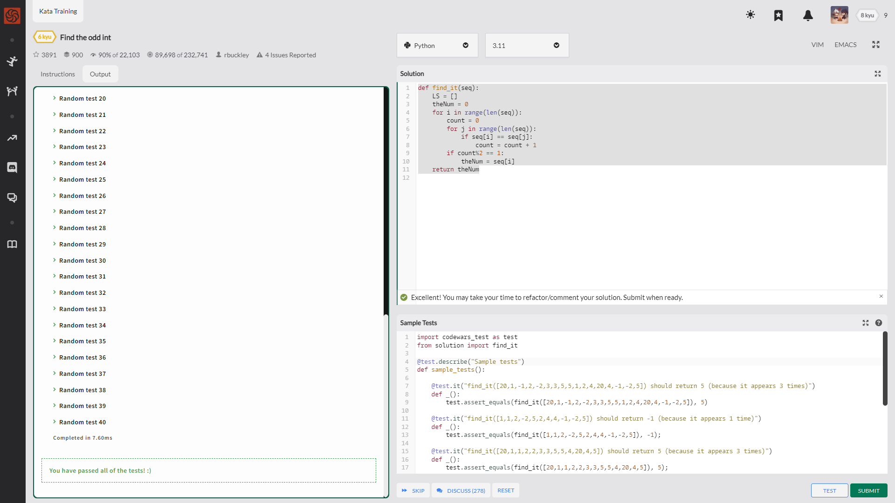
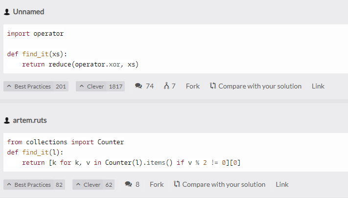

Given an array of integers, find the one that appears an odd number of times.

给定一个全都是int类型的数组列表，找到其中出现了奇数次的数字，数字

There will always be only one integer that appears an odd number of times.

Examples

    [7] should return 7, because it occurs 1 time (which is odd).
    [0] should return 0, because it occurs 1 time (which is odd).
    [1,1,2] should return 2, because it occurs 1 time (which is odd).
    [0,1,0,1,0] should return 0, because it occurs 3 times (which is odd).
    [1,2,2,3,3,3,4,3,3,3,2,2,1] should return 4, because it appears 1 time (which is odd)

    def find_it(seq):
        LS = []
        theNum = 0
        for i in range(len(seq)):
            count = 0
            for j in range(len(seq)):
                if seq[i] == seq[j]:
                    count = count + 1
                if count//2 != 1:
                    theNum = seq[i]
        return theNum

    def find_it(seq):
    LS = []
    theNum = 0
    for i in range(len(seq)):
        count = 0
        for j in range(len(seq)):
            if seq[i] == seq[j]:
                count = count + 1
        if count%2 == 1:
            theNum = seq[i]
    return theNum

原来还有.count这种东西？

    def find_it(seq):
        for i in seq:
            if seq.count(i)%2!=0:
                return i

Python List count()方法

    list.count(obj)

    obj -- 列表中统计的对象
    返回元素在列表中出现的次数

odd number

    import codewars_test as test
    from solution import find_it

    @test.describe("Sample tests")
    def sample_tests():
        
        @test.it("find_it([20,1,-1,2,-2,3,3,5,5,1,2,4,20,4,-1,-2,5]) should return 5 (because it appears 3 times)")
        def _():
            test.assert_equals(find_it([20,1,-1,2,-2,3,3,5,5,1,2,4,20,4,-1,-2,5]), 5)
            
        @test.it("find_it([1,1,2,-2,5,2,4,4,-1,-2,5]) should return -1 (because it appears 1 time)")
        def _():
            test.assert_equals(find_it([1,1,2,-2,5,2,4,4,-1,-2,5]), -1);
            
        @test.it("find_it([20,1,1,2,2,3,3,5,5,4,20,4,5]) should return 5 (because it appears 3 times)")
        def _():
            test.assert_equals(find_it([20,1,1,2,2,3,3,5,5,4,20,4,5]), 5);
            
        @test.it("find_it([10]) should return 10 (because it appears 1 time)")
        def _():
            test.assert_equals(find_it([10]), 10);

        @test.it("find_it([10, 10, 10]) should return 10 (because it appears 3 times)")
        def _():
            test.assert_equals(find_it([10, 10, 10]), 10);        
            
        @test.it("find_it([1,1,1,1,1,1,10,1,1,1,1]) should return 10 (because it appears 1 time)")
        def _():
            test.assert_equals(find_it([1,1,1,1,1,1,10,1,1,1,1]), 10);

        @test.it("find_it([5,4,3,2,1,5,4,3,2,10,10]) should return 1 (because it appears 1 time)")
        def _():
            test.assert_equals(find_it([5,4,3,2,1,5,4,3,2,10,10]), 1);