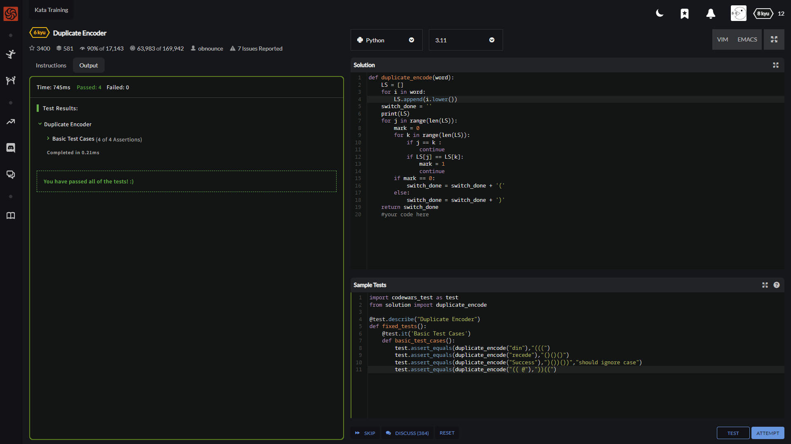
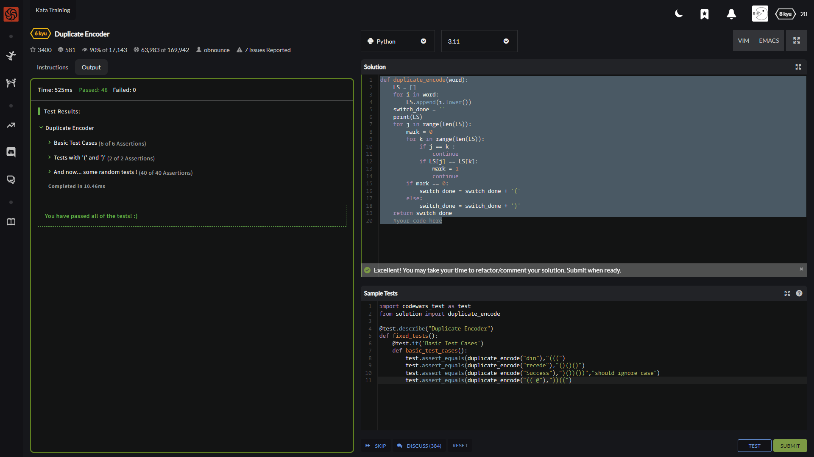

The goal of this exercise is to convert a string to a new string where each character in the new string is "(" if that character appears only once in the original string, or ")" if that character appears more than once in the original string. Ignore capitalization when determining if a character is a duplicate.

## Examples

    "din"      =>  "((("
    "recede"   =>  "()()()"
    "Success"  =>  ")())())"
    "(( @"     =>  "))((" 

简单翻译一下

就是说 你要写一个函数 将字符串转化为由'('与')'组成的字符串

转换前后的字符串长度相同 空格也算在内

如果一个字符在该字符串中只出现过一次用')'

如果一个字符在该字符串中重复出现过多次用'('

转换无视大小写

↑其实吧 写的时候出的问题挺多的 漏符号的错误犯了个遍

    def duplicate_encode(word):
        LS = [] # 创建一个空列表来存放拆开的每一个字符
        for i in word:
            LS.append(i.lower()) # 将所有的字符统一转换为小写后存入提前生成的空容器中
        switch_done = '' # 创建一个存放结果的空字符串变量
        print(LS)
        for j in range(len(LS)): # 对每个字符进行循环比对
            mark = 0 # 默认标记为0 即只出现过一次
            for k in range(len(LS)): # 对之前选出的字符进行循环比对
                if j == k :
                    continue # 跳过与自己比对
                if LS[j] == LS[k]:
                    mark = 1 # 如果出现相同的标记转换为1 即出现多次
                    continue # 这其实该写break 能加快一些效率
            if mark == 0: # 根据mark标记来决定字符是否只出现过一次
                switch_done = switch_done + '('
            else:
                switch_done = switch_done + ')'
        return switch_done

    print(str.upper())          # 把所有字符中的小写字母转换成大写字母
    print(str.lower())          # 把所有字符中的大写字母转换成小写字母
    print(str.capitalize())     # 把第一个字母转化为大写字母，其余小写
    print(str.title())          # 把每个单词的第一个字母转化为大写，其余小写 

哈 还不错

看看社区里边都咋做的啊

来自SevenEcks的答案 这个写的相当的好

    #This solution is O(n) instead of O(n^2) like the methods that use .count()
    #because .count() is O(n) and it's being used within an O(n) method.
    #The space complexiety is increased with this method.
    import collections
    def duplicate_encode(word):
        new_string = ''
        word = word.lower()
        #more info on defaultdict and when to use it here:
        #http://stackoverflow.com/questions/991350/counting-repeated-characters-in-a-string-in-python
        d = collections.defaultdict(int)
        for c in word:
            d[c] += 1
        for c in word:
            new_string = new_string + ('(' if d[c] == 1 else ')')
        return new_string

以及昨天刚知道的collections的Counter

    from collections import Counter

    def duplicate_encode(word):
        word = word.lower()
        counter = Counter(word)
        return ''.join(('(' if counter[c] == 1 else ')') for c in word)

EMMMMM 这个count与join 行叭

    def duplicate_encode(word):
        return "".join(["(" if word.lower().count(c) == 1 else ")" for c in word.lower()])

