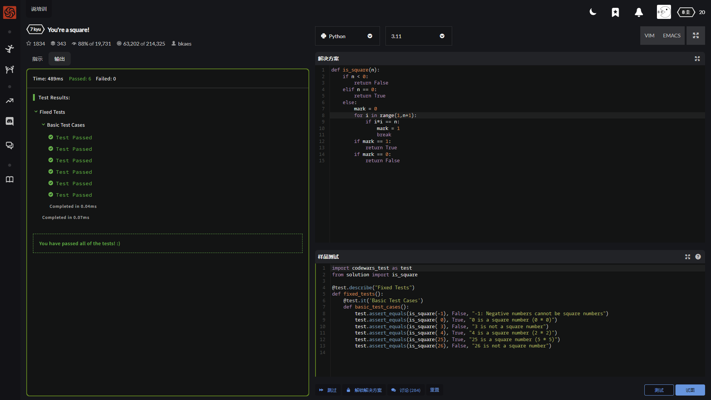
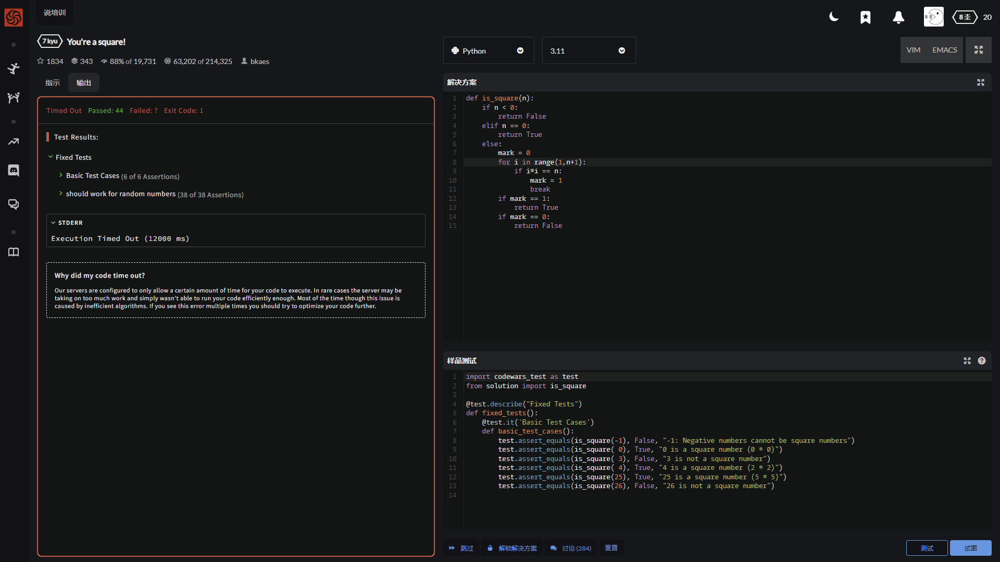
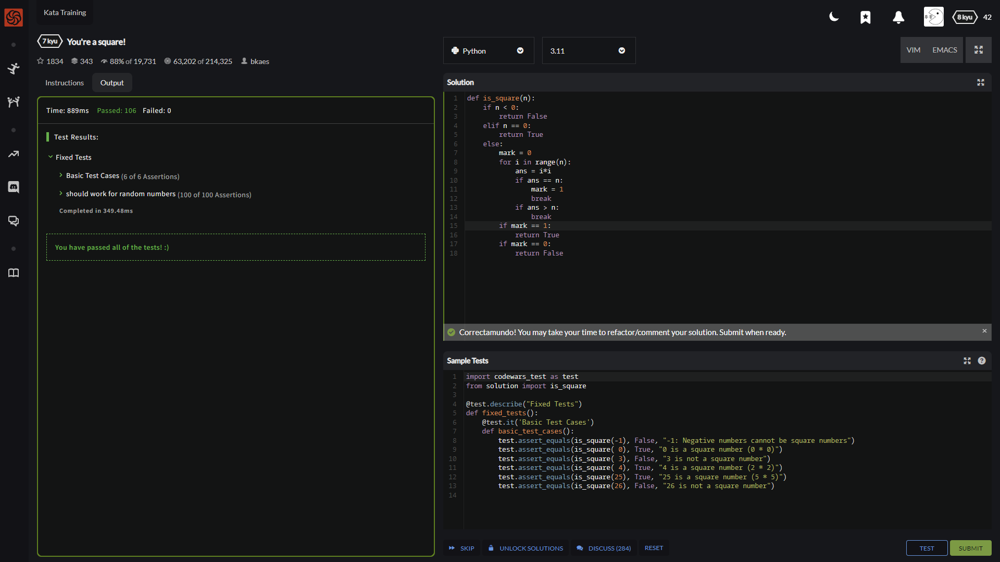

哦坏了 忘了粘原文了

大致这意思就是

给个数 保证是整数 看看这个整数是不是某个整数的平方数

我这边的思路呢 大致就是 α开算数平方根一定小于α (α∈整数，坏了 就这个水平还想考研？ 哦法克 今天还他妈是CET4考试)

然后 小于α的数的平方一个个试↓

↑令人满意的4次基础测试

    def is_square(n):
        if n < 0:
            return False
        elif n == 0:
            return True
        else:
            mark = 0
            for i in range(1,n+1): # 0比较特殊就不用试了
                if i*i == n:
                    mark = 1 # 匹配到满足条件的数值后 标记转换为1
                    break
            if mark == 1:
                return True
            if mark == 0:
                return False

就是这个效率吧 稍微大点的估计客户就等不起了

于是修改方法

平方结果大于α的直接终止循环 能节省很大一部分时间 但如果n的数值很大的话 还是要花很多时间的

虽然过了 其实这里边有个后续隐患 看代码

    def is_square(n):
        if n < 0:
            return False
        elif n == 0:
            return True
        else:
            mark = 0
            for i in range(n): # 如果n = 1  的话 这个循环只重复一次 即i = 1 结果就是 n = 1时 只进行0*0=0 导致mark还是0 输出为False
                ans = i*i 
                if ans == n:
                    mark = 1 
                    break
                if ans > n:
                    break
            if mark == 1:
                return True
            if mark == 0:
                return False

---

社区答案

基本上集中在使用math库

---

    import math
    def is_square(n):    
        try:
            return math.sqrt(n).is_integer()
        except ValueError:
            return False

---

    def is_square(n):    
        if n>=0:
            if int(n**.5)**2 == n:
                return True
        return False

---

    def is_square(n): 
        if n < 0:
            return False
        if n == 0:
            return True
        k = 1
        while True:
            k_square = k**2
            if k_square > n:
                return False
            if k_square == n:
                return True
            k = k + 1

---

    import math
    def is_square(n):
        return n > -1 and math.sqrt(n) % 1 == 0;

---

Orz

    def is_square(n):    
        return n >= 0 and (n**0.5) % 1 == **0**
