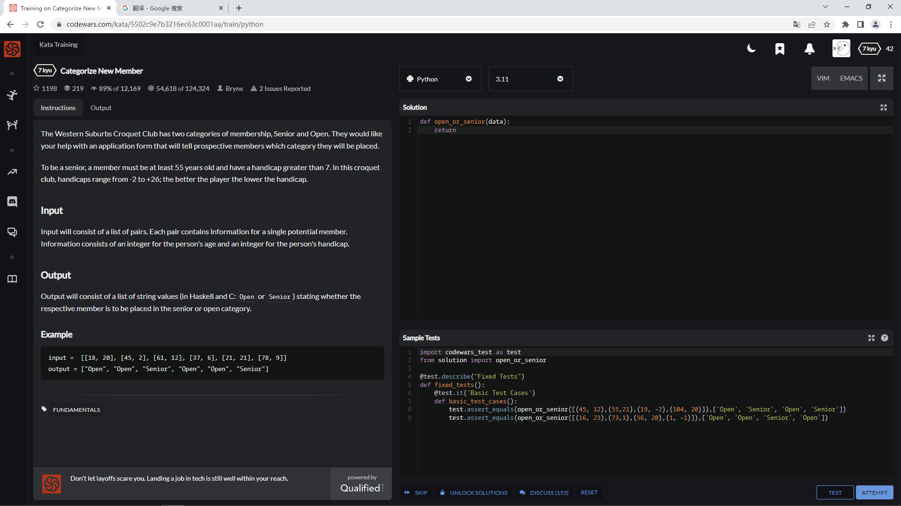
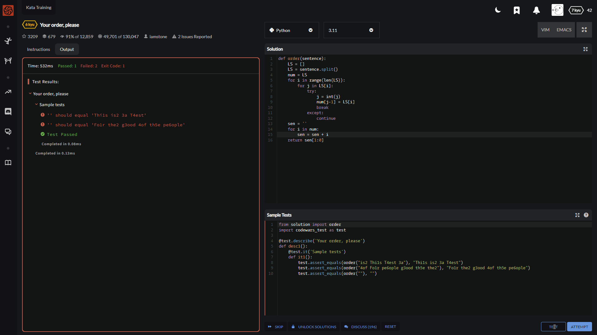
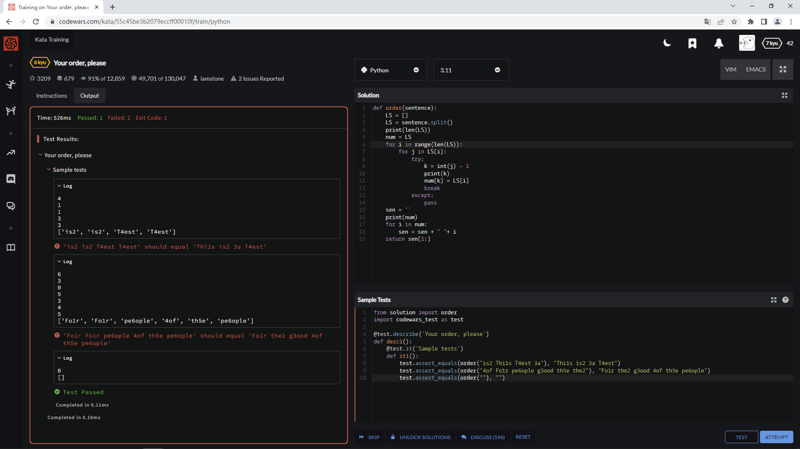
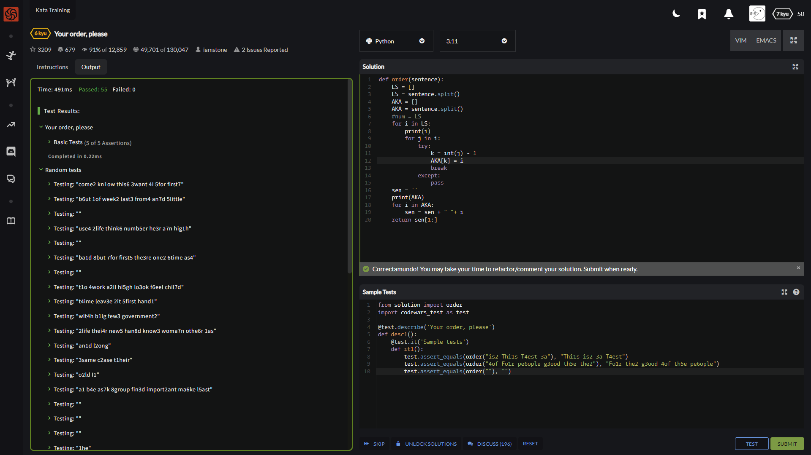
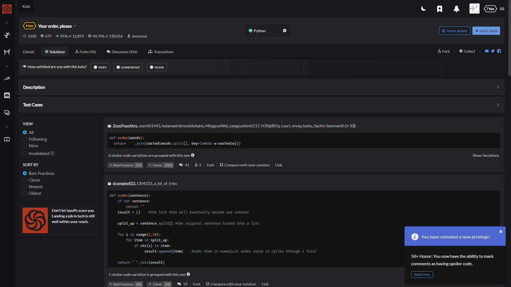

The Western Suburbs Croquet Club has two categories of membership, Senior and Open. They would like your help with an application form that will tell prospective members which category they will be placed.

To be a senior, a member must be at least 55 years old and have a handicap greater than 7. In this croquet club, handicaps range from -2 to +26; the better the player the lower the handicap.

Input

Input will consist of a list of pairs. Each pair contains information for a single potential member. Information consists of an integer for the person's age and an integer for the person's handicap.

Output

Output will consist of a list of string values (in Haskell and C: Open or Senior) stating whether the respective member is to be placed in the senior or open category.

Example

input =  [[18, 20], [45, 2], [61, 12], [37, 6], [21, 21], [78, 9]]
output = ["Open", "Open", "Senior", "Open", "Open", "Senior"]

嗝 这个题读不懂

---
---
---

Your task is to sort a given string. Each word in the string will contain a single number. This number is the position the word should have in the result.

Note: Numbers can be from 1 to 9. So 1 will be the first word (not 0).

If the input string is empty, return an empty string. The words in the input String will only contain valid consecutive numbers.

大致就是

给你个句子 每个单词里边包含一个数字 范围是1-9

然后你要将这些数字作为顺序 连带着单词一起重新排序

具体看下边的例子更好理解

## Examples

    "is2 Thi1s T4est 3a"  -->  "Thi1s is2 3a T4est"
    "4of Fo1r pe6ople g3ood th5e the2"  -->  "Fo1r the2 g3ood 4of th5e pe6ople"
    ""  -->  ""

基本思路就是 将这个句子 用.strip()方法 生成出一个list

然后复制两份这个list 一份用于遍历 另一份用于存储交换后的结果(与其说交换不如说置换)

用到的具体方法 是利用强制转换报错的方法

首先 遍历每一个单词 然后再遍历单词中的每一个字母

如果为数字 则不会报错正常进行 如果是字母 则不会执行强制转换后的语句 会继续遍历

然后直接将数字作为结果位置的索引(数值要-1)并赋值给用于储存结果的list

最后组合输出 去掉开头空格

哦我草 竟然还踏马过了1个

    def order(sentence):
        LS = []
        LS = sentence.split()
        print(len(LS))
        num = LS
        for i in range(len(LS)):
            for j in LS[i]:
                try:
                    k = int(j) - 1
                    print(k)
                    num[k] = LS[i]
                    break
                except:
                    pass
        sen = ''
        print(num)
        for i in num:
            sen = sen + " "+ i
        return sen[1:]

    def order(sentence):
        LS = []
        LS = sentence.split()
        AKA = []
        AKA = sentence.split()
        #num = LS
        for i in LS:
            print(i)
            for j in i:
                try:
                    k = int(j) - 1
                    AKA[k] = i
                    break
                except:
                    pass
        sen = ''
        print(AKA)
        for i in AKA:
            sen = sen + " "+ i
        return sen[1:]

虽然过了 但是我不能理解啊

num是关键字吗？

网上的说法不太可靠啊

线下测试用的是3.9

网站是3.11

想不明白

---

    def order(words):
    return ' '.join(sorted(words.split(), key=lambda w:sorted(w)))

---

    def order(sentence):
        if not sentence:
            return ""
        result = []    #the list that will eventually become our setence
        
        split_up = sentence.split() #the original sentence turned into a list
    
        for i in range(1,10):
            for item in split_up:
                if str(i) in item:
                    result.append(item)    #adds them in numerical order since it cycles through i first
    
        return " ".join(result)

---

    def order(s):
        z = []
        for i in range(1,10):
            for j in list(s.split()):
                if str(i) in j:
                z.append(j)
        return " ".join(z)

