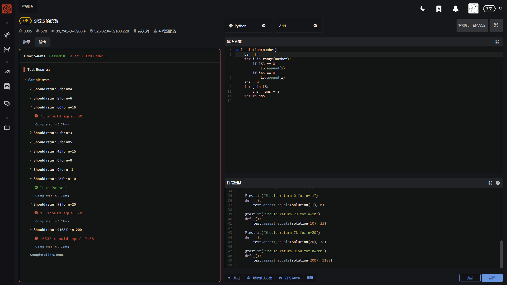
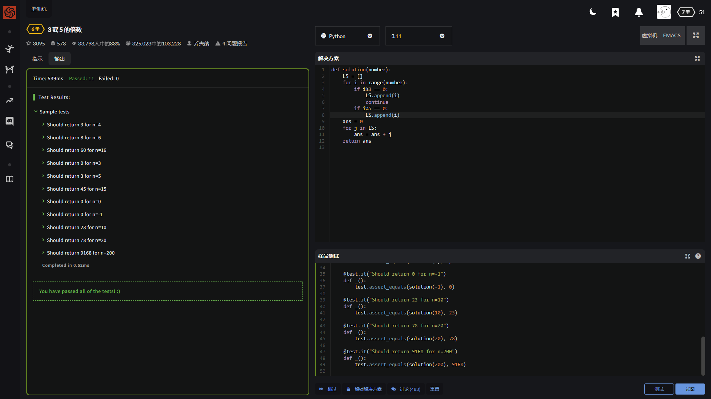

哇哦 今天(然而我也没看315晚会)上传晚了

顺便庆祝一下 我的笔记本变成双系统了

If we list all the natural numbers below 10 that are multiples of 3 or 5, we get 3, 5, 6 and 9. The sum of these multiples is 23.

Finish the solution so that it returns the sum of all the multiples of 3 or 5 below the number passed in. Additionally, if the number is negative, return 0 (for languages that do have them).

Note: If the number is a multiple of both 3 and 5, only count it once.

Courtesy of projecteuler.net (Problem 1)

给一个数 然后他前边的数 然后将它前边所有能被3或5整除的数求和

还给了个提示 如果这个数即能被3整除又能被5整除 只结算1次

例子:

    10
    前边为1-9
    3,5,6,9 能被3或5整除
    结果返回 23

P.S. 我昨天比较着急 连源码都没保存下来

大致讲解一下 依次对数进行%3与%5的取整操作 有余数的取消掉 如果能%3无余数 则不进行%5的判定

---

    def solution(number):
        a3 = (number-1)/3
        a5 = (number-1)/5
        a15 = (number-1)/15
        result = (a3*(a3+1)/2)*3 + (a5*(a5+1)/2)*5 - (a15*(a15+1)/2)*15
        return result

---

    def solution(number):
        sum = 0
        for i in range(number):
            if (i % 3) == 0 or (i % 5) == 0:
                sum += i
        return sum

---

    def solution(number):
        return sum(x for x in range(number) if x % 3 == 0 or x % 5 == 0)

---

    def solution(number):
        return sum([x for x in raSnge(number) if x % 3 == 0 or x % 5 == 0])