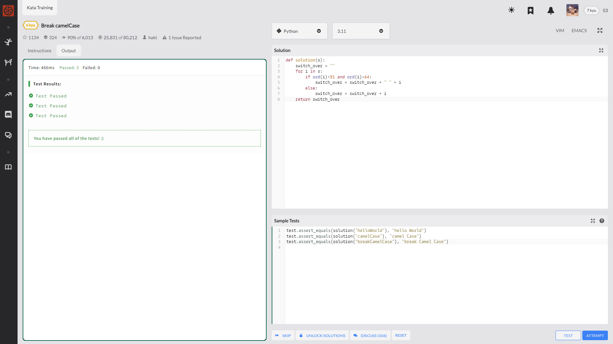
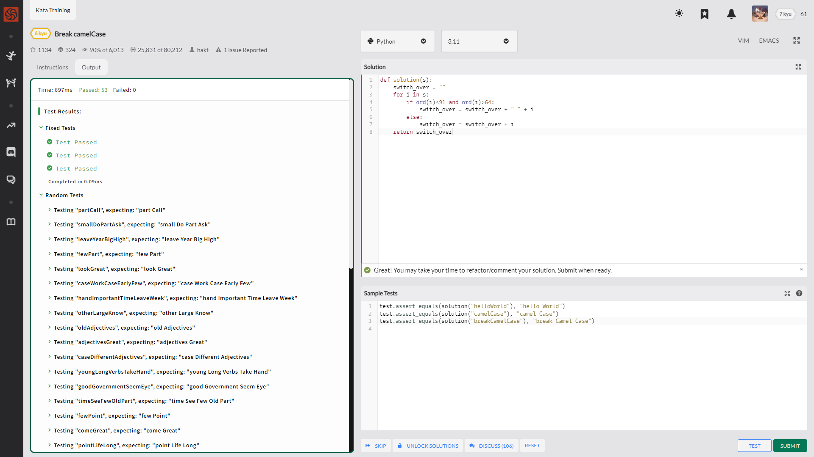

说实话 我也忘了瞎忙了多久了

重启需要坚持

Complete the solution so that the function will break up camel casing, using a space between words.

要解决的问题就是

将小驼峰法的整个字符串

在大写字母前加个空格

Example

    "camelCasing"  =>  "camel Casing"
    "identifier"   =>  "identifier"
    ""             =>  ""

---

---

    def solution(s):
        switch_over = ""
        for i in s:
            if ord(i)<91 and ord(i)>64: # ASCII的大写范围是 65-90
                switch_over = switch_over + " " + i
            else:
                switch_over = switch_over + i
        return switch_over

还算不错的 没出啥大问题

---

社区时间！

社区里边很多人用到了里边自带的一个大小写检测方法

str.isupper()

    str = "THIS IS STRING EXAMPLE....WOW!!!"
    print (str.isupper())

    str = "THIS is string example....wow!!!"
    print (str.isupper())

结果↓

True

False

---

    def solution(s):
        final_string = ""
        for i in range(len(s)):
            char = s[i]
            if char.isupper():
                final_string += " " + char
            else:
                final_string += char
        return final_string

---

    import re
    def solution(s):
        return re.sub('([A-Z])', r' \1', s)

---

    def solution(s):
        return ''.join(' ' + c if c.isupper() else c for c in s)