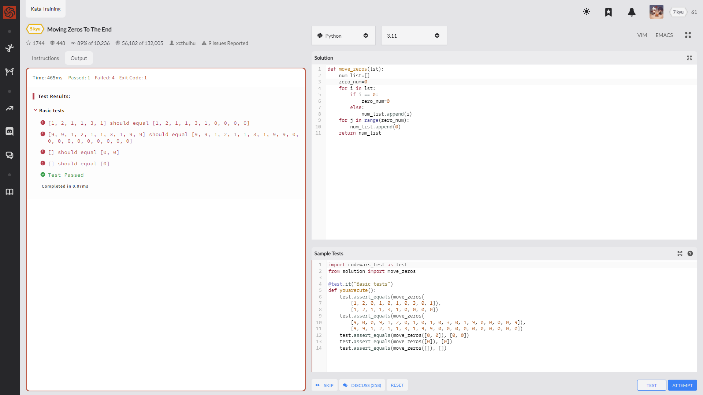
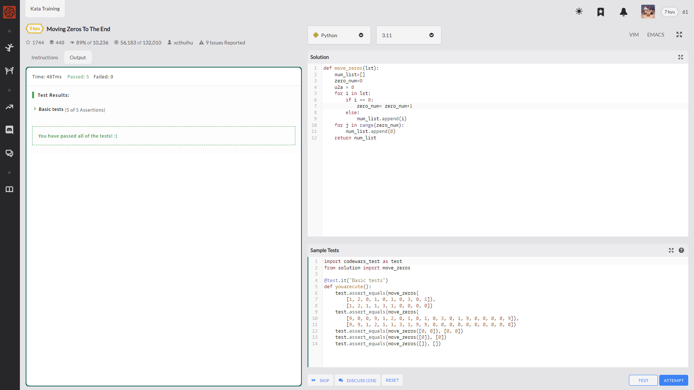
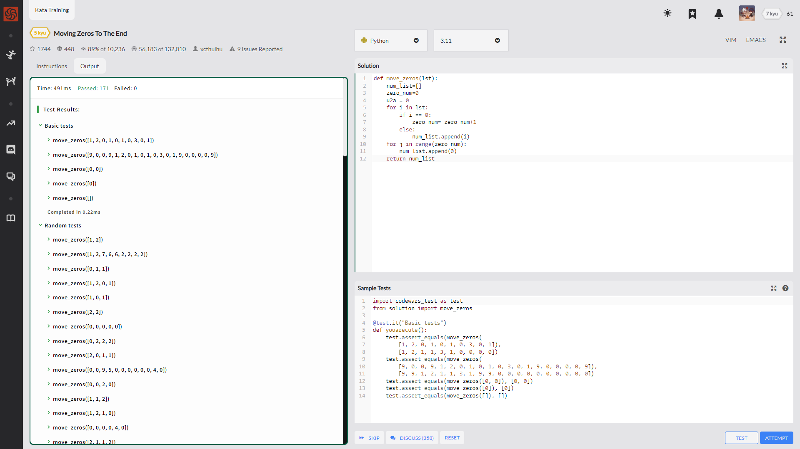

Write an algorithm that takes an array and moves all of the zeros to the end, preserving the order of the other elements.

    move_zeros([1, 0, 1, 2, 0, 1, 3]) # returns [1, 1, 2, 1, 3, 0, 0]

翻译一下啊

就是说

给个全是int的list

返回的时候 把0全扔后边 前面顺序不变

---

这个思路啊 也很简单

遍历列表中的每一个数

不等于0的 扔到一个新的list中

等于0的 计一次数

然后依据这个计数 再把等量的0加进去

---

    def move_zeros(lst):
        num_list=[]
        zero_num=0
        for i in lst:
            if i == 0:
                zero_num=0
            else:
                num_list.append(i)
        for j in range(zero_num):
            num_list.append(0)
        return num_list

我是半价本体全价终极版2042

    def move_zeros(lst):
        num_list=[]
        zero_num=0
        u2a = 0
        for i in lst:
            if i == 0:
                zero_num= zero_num+1
            else:
                num_list.append(i)
        for j in range(zero_num):
            num_list.append(0)
        return num_list

有惊无险

---
---
---

社区时间 这题我还挺期待的

---

    def move_zeros(array):
        newarr =[]
        zeroarr=[]
        for item in array:
            if item!= 0 or type(item)== bool :
                newarr.append(item)
            else:
                zeroarr.append(item)
                
                
        newarr.extend(zeroarr)
        return(newarr)

---

    def move_zeros(a):
        a.sort(key=lambda v: v == 0)
        return a

---

    def move_zeros(array):
        for i in array:
            if i == 0:
                array.remove(i) # Remove the element from the array
                array.append(i) # Append the element to the end
        return array

---

    def move_zeros(arr):
        l = [i for i in arr if isinstance(i, bool) or i!=0]
        return l+[0]*(len(arr)-len(l))

---

    def move_zeros(array):
        return sorted(array, key=lambda x: x==0 and type(x) is not bool)

---

    def move_zeros(array):
        return [x for x in array if x] + [0]*array.count(0)

---

    def move_zeros(array):
        return [a for a in array if isinstance(a, bool) or a != 0] + [a for a in array if not isinstance(a, bool) and a == 0]

---

哦呵呵 这题可真是太精彩了
